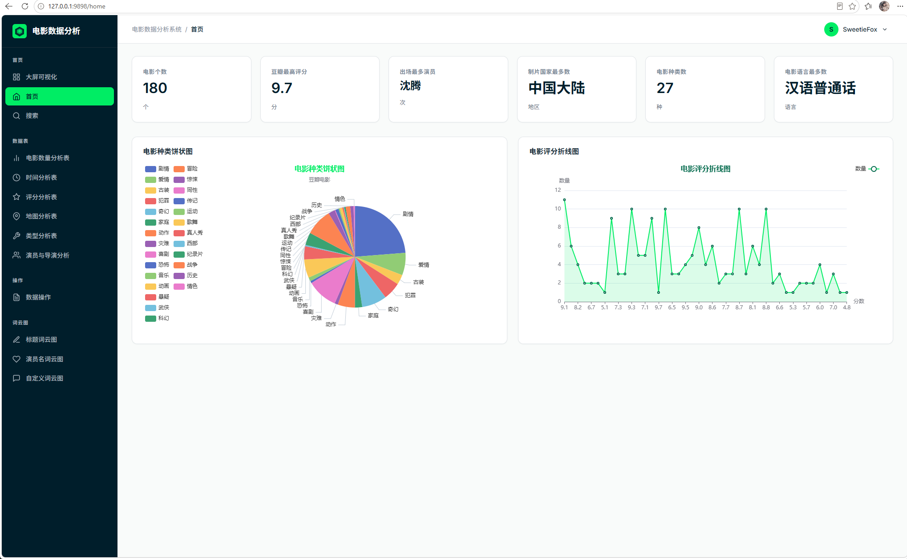
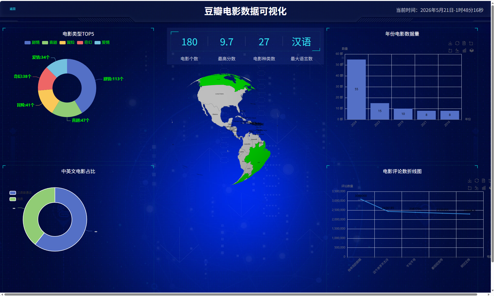

# 豆瓣电影数据分析系统

基于 Flask + ECharts 的豆瓣电影数据可视化分析平台，提供从数据爬取、存储、分析到前端展示的完整解决方案。

## 界面展示

### 概览仪表板



首页展示电影总数、最高评分、热门演员、电影类型、常见语言等核心指标，以及评分分布、类型占比等交互式图表。

### 大屏可视化



全屏数据大屏模式，集成类型饼图、年份柱状图、语言分布、评论趋势折线图及 3D 地图，适合演示汇报场景。

## 功能概览

- **数据爬取** — 自动抓取豆瓣电影详情（评分、类型、演员、国家、语言、片长等）及用户评论
- **概览仪表板** — 展示电影总数、最高评分、热门演员、电影类型、常见语言等核心指标
- **交互式图表** — 按类型、评分、年份、国家、语言、片长等维度进行数据可视化
- **可搜索数据表** — 支持分页浏览完整电影记录
- **词云分析** — 对电影片名、演员姓名、评论内容生成词云
- **大屏可视化** — 全屏展示模式，适合数据大屏演示
- **用户认证** — 基于 Session 的登录/注册功能

## 技术栈

| 层级 | 技术 |
|------|------|
| 后端框架 | Python Flask |
| 数据库 | MySQL (PyMySQL) |
| 数据处理 | Pandas, NumPy |
| 数据可视化 | Pyecharts, ECharts.js |
| 词云生成 | StyleCloud |
| 前端 | Jinja2 模板, HTML/CSS/JavaScript |
| 数据爬虫 | Requests + lxml + BeautifulSoup |

## 项目结构

```
gzdouban/
├── app.py                    # 应用入口，Flask 路由定义
├── tools/                    # 数据处理与业务逻辑
│   ├── getDataBase.py        # 数据库连接
│   ├── getData.py            # 数据导出 (MySQL → CSV)
│   ├── homeData.py           # 核心数据查询与分析
│   ├── actor.py              # 演员/导演排行统计
│   ├── addressData.py        # 国家/地区分布统计
│   ├── timeData.py           # 时间/年份维度分析
│   ├── typeData.py           # 电影类型统计
│   ├── rateData.py           # 评分分析
│   ├── word_cloud.py         # 词云生成
│   └── data/                 # 导出的 CSV 数据文件
├── spider/                   # 豆瓣数据爬虫
│   ├── 电影详细数据.py        # 电影详情爬虫
│   └── 电影评论数据.py        # 电影评论爬虫
├── templates/                # Jinja2 前端模板（18个页面）
│   ├── base.html             # 主布局（侧边栏、导航栏）
│   ├── home.html             # 仪表板首页
│   ├── analysis.html         # 大屏可视化
│   ├── tables.html           # 数据表格
│   ├── login.html            # 登录页
│   ├── register.html         # 注册页
│   └── ...                   # 各分析维度页面
├── static/                   # 前端静态资源
│   ├── css/                  # 样式表（MongoDB 主题）
│   ├── js/                   # JavaScript 库（ECharts 等）
│   ├── images/               # 背景图与词云输出
│   ├── font/                 # 字体文件（SimHei）
│   ├── 404/                  # 404 页面资源
│   └── html/                 # Pyecharts 生成图表
├── assets/                   # 项目截图等资源
├── test/                     # 测试脚本
└── DESIGN.md                 # MongoDB 设计系统参考
```

## 数据库结构

数据库：`movie_system` (MySQL)

### movies 表

| 字段 | 说明 |
|------|------|
| id | 电影 ID |
| directors | 导演 |
| rate | 评分 |
| title | 片名 |
| casts | 演员 |
| cover | 封面图 |
| year | 上映年份 |
| types | 电影类型 |
| country | 制片国家/地区 |
| lang | 语言 |
| time | 上映日期 |
| movieTime | 片长 |
| commentLen | 评论数量 |
| star | 星级分布 |
| summary | 简介 |
| imgList | 图片列表 |
| detailLink | 详情页链接 |

### users 表

| 字段 | 说明 |
|------|------|
| username | 用户名 |
| password | 密码 |

### comments 表

| 字段 | 说明 |
|------|------|
| movieName | 电影名称 |
| commentContent | 评论内容 |

## 快速开始

### 环境要求

- Python 3.x
- MySQL 5.7+
- 中文字体支持（SimHei）

### 安装依赖

```bash
pip install flask pymysql pandas numpy pyecharts stylecloud requests lxml beautifulsoup4 sqlalchemy
```

### 配置数据库

1. 创建 MySQL 数据库：
```sql
CREATE DATABASE movie_system;
```

2. 修改 `tools/getDataBase.py` 中的数据库连接信息：
```python
conn = pymysql.connect(
    host='localhost',
    port=3306,
    user='root',
    password='your_password',
    database='movie_system'
)
```

3. 运行爬虫获取数据：
```bash
cd spider
python 电影详细数据.py
python 电影评论数据.py
```

### 启动应用

```bash
python app.py
```

访问 `http://127.0.0.1:9898` 查看系统。

## 页面路由

| 路由 | 功能 |
|------|------|
| `/`, `/login` | 用户登录 |
| `/register` | 用户注册 |
| `/home` | 概览仪表板（统计卡片 + 图表） |
| `/search/<id>` | 电影搜索 |
| `/time_t` | 年份与片长分析 |
| `/rate_t/<type>` | 评分分析（多维度） |
| `/datasort` | 分类数据排序 |
| `/address_t` | 国家/地区分布地图 |
| `/type_t` | 电影类型 Top 10 |
| `/actor_t` | 演员/导演排行 |
| `/tables/<id>` | 电影数据表 |
| `/title_c` | 片名词云 |
| `/casts_c` | 演员词云 |
| `/comments_c` | 评论词云 |
| `/analysis1` | 大屏可视化 |
| `/logout` | 退出登录 |

## 数据流

```
豆瓣网站 ──► spider/ (爬虫) ──► MySQL (movie_system)
                                    │
                                    ▼
                            tools/getData.py (CSV 导出)
                                    │
                                    ▼
                            tools/data/*.csv
                                    │
                                    ▼
                    app.py (Flask) ──► tools/*.py (分析)
                                    │
                                    ▼
              Jinja2 模板 + ECharts/Pyecharts ──► 浏览器
```
